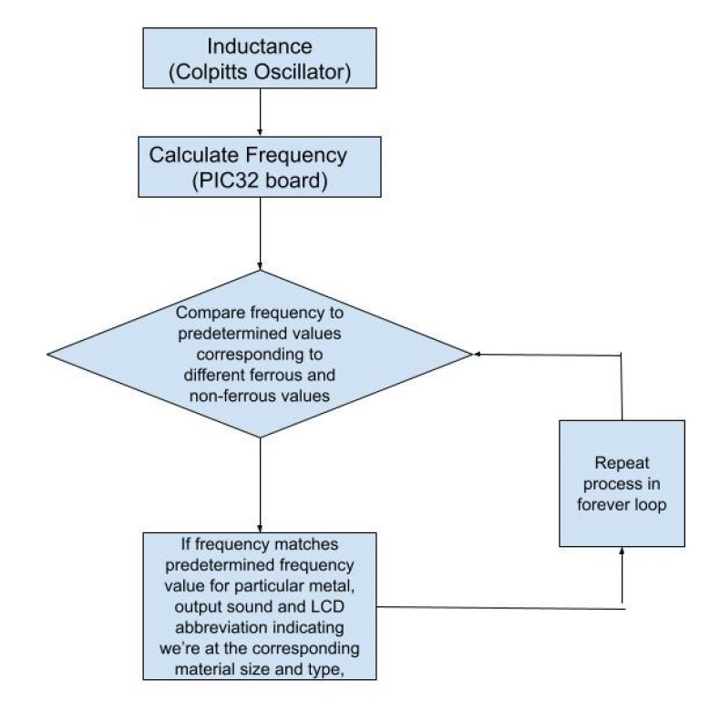

- A metal detector that uses a magnetic wire coil whose inductance changes when a metal is placed close by.
- Uses a Colpitts oscillator implemented using a NOT gate from discrete MOSFETS that would convert inductance changes in the magnetic coil to frequency variations
- Microcontroller system (PIC32MX130F064B board) programmed in C (`metalDetector.c`) to provide audible feedback on the kind of metal detected 

## Hardware 

1. PIC32MX130F063B Board: The central microcontroller of the system running on embedded-C architecture.
2. MCP1700-3320E: A low dropout positive voltage regulator 5V → 3.3V.
3. Sensor coil: An inductive coil created by looping an inductive material 100 times
4. 25Q32: A 4MB SPI memory
5. LM386: To amplify the speaker
6. LM7805: A low dropout positive voltage regulator 9V → 5V

## Algorithm  

##  Circuit

## Video demo
[Youtube Link](https://youtu.be/pajMGd9RIf4)